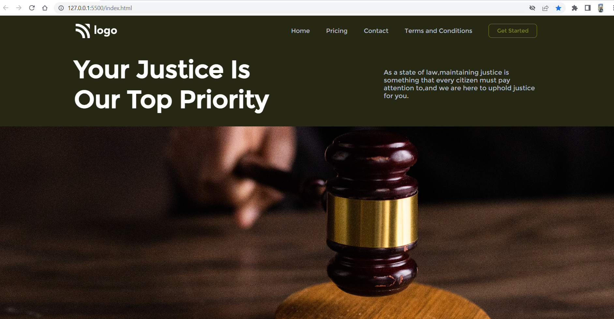

# Project 3: Law Home Page

   

### Name:

> `Anshul Ghogre`

## Key Learnings from the project

- _Explored new ways for background properties with the help of MDN docs._
- _Found a way to include SVG files from websites and implementing it as well._

---

### Screenshots:-

---

> Time taken to complete this project: 5hrs

---

## [Live-Link](https://project-2-food-restaurant-home-page.netlify.app/)

---
